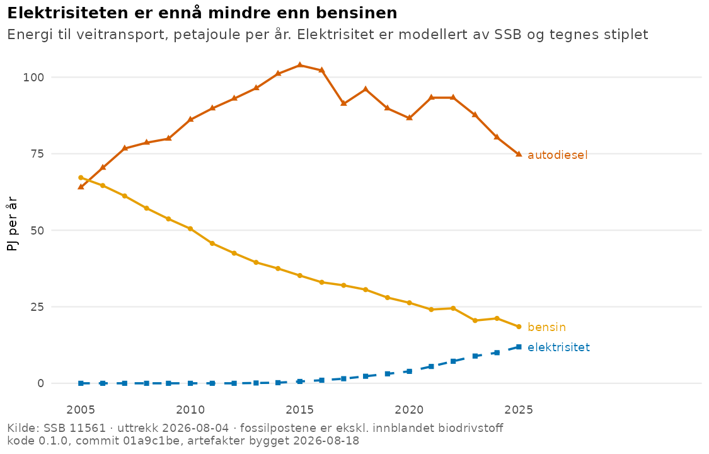
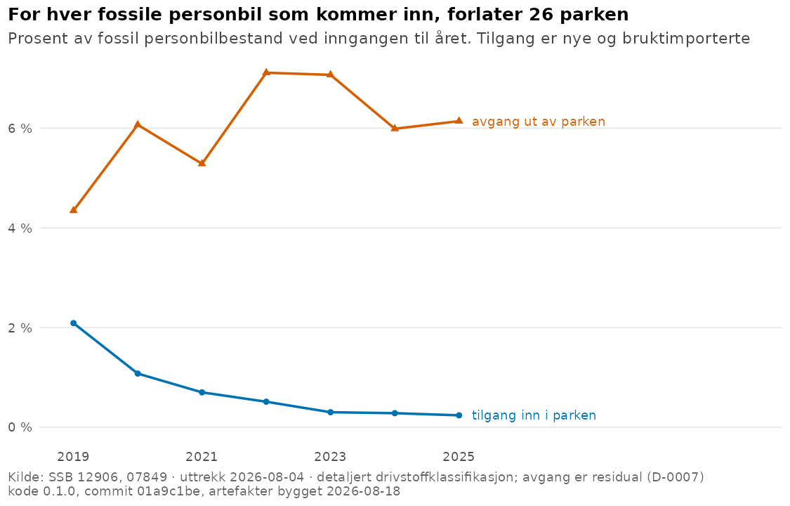
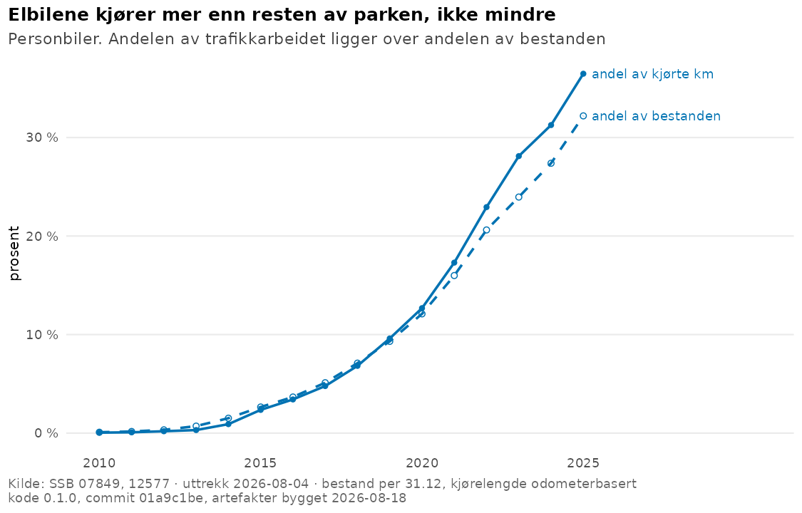
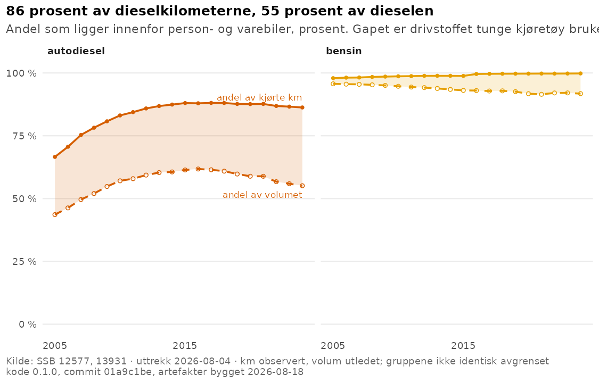
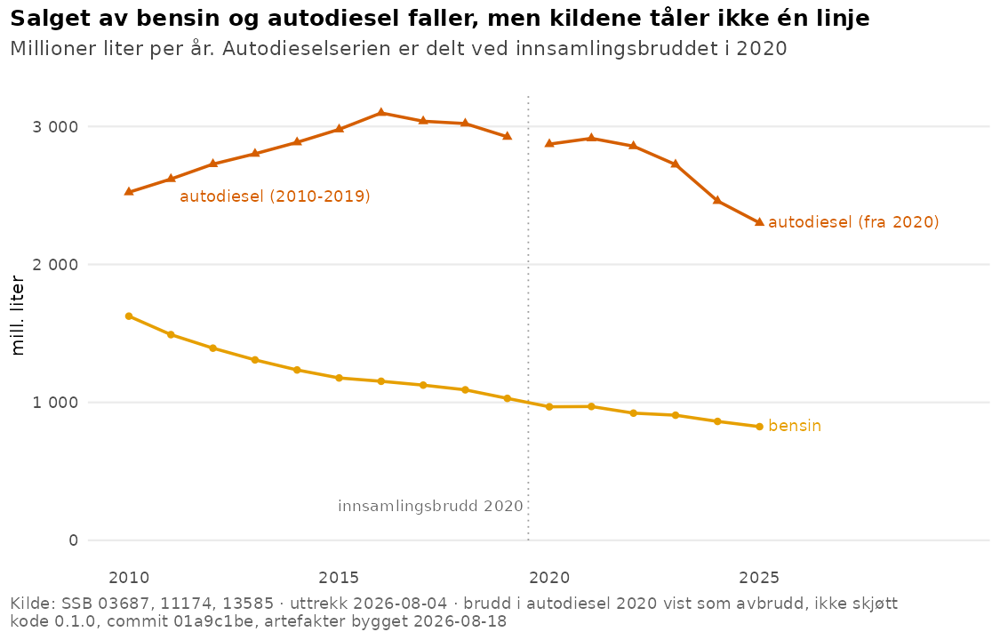

# Energiomstillingen i norsk veitransport

[](https://github.com/Torcode/veitransport-energi/actions/workflows/pr-checks.yml)

Hvordan utskiftingen av person- og varebilparken omsettes i etterspørsel etter bensin, autodiesel og elektrisitet — historisk fra 1995, og i betingede scenarioer fram mot 2035. Bygget for beslutninger der etterspørselsbanen er premisset: avgiftsproveny som faller ulikt for bensin og diesel, dimensjonering av ladeinfrastruktur, og vurdering av hvor lenge en fossil restetterspørsel blir stående.



Figuren viser energien som faktisk går til veitransport, fordelt på de tre
bærerne, i petajoule per år. Den er førstevisningen fordi den er spørsmålet:
alt annet i dette repoet er begrunnelse for hvordan disse tre linjene er
framkommet og hva som kan sies om deres fortsettelse. Mønsteret kommer av at
bensinparken har blitt skiftet ut i tjue år mens dieselparken vokste til 2015 og
siden har falt langsommere. Begrensningen som følger med: postene er
energibalansens, elektrisitetsposten er modellert av SSB og dens fordelingsmetode
er ikke dokumentert i det som er hentet — derfor er den linjen stiplet.

## Hovedfunnet

**Den spaken norske omstillingsanalyser vanligvis betinger på, er brukt opp.** Elandelen av nyregistrerte personbiler var 94,8 prosent i 2025; bensin og diesel utgjorde 2,2 prosent til sammen. Forskjellen mellom et scenario med 95 og ett med 100 prosent er to prosent av nyregistreringene i én årgang. Den fossile tilgangen til personbilparken var 4 100 biler mot en fossil bestand på 1,6 millioner — **0,25 prosent**. Neste års fossile bilpark er i praksis allerede bestemt.



Figuren viser de to strømmene inn og ut av den fossile personbilparken, begge
målt mot bestanden ved inngangen til året. Den er relevant fordi et scenario om
nyregistreringer virker gjennom den øverste linjen, og den er nå så lav at
avstanden til den nederste avgjør utfallet alene. Mønsteret oppstår ved at
tilgangsraten har falt til under en åttendedel siden 2019 mens avgangsraten har
ligget flatt mellom fire og sju prosent. Begrensningen: avgangen er en residual som også
rommer eksport, avregistrering og omklassifisering, og serien starter i 2019
fordi den detaljerte drivstoffklassifikasjonen gjør det.

Usikkerheten har flyttet seg til tre andre steder, og alle tre er tallfestet her:

**Hvor fort den eksisterende parken forlater veien.** Kohortmodellen identifiserer levetidsnivået godt, men ikke formen på avgangskurven — 4–10 prosents spredning på skalaen mot 40–45 på formen ved reestimering på rullerende vinduer. Det er formen en framskriving er følsom for.

**Hvor mye de gjenværende fossile bilene kjøres.** Kjørelengden per bensinbil har falt fra 10 160 til 8 060 km i året siden 2016, per dieselbil fra 15 430 til 12 420, mens elbilene har gått fra 11 910 til 13 530. I nivå ser fallet strukturelt ut — korrelasjonen med modellert flåtealder er −0,978 — men i førstedifferanser forsvinner sammenhengen (−0,03). Alder og kalendertid er nær kollineære i vinduet, så mekanismen er ikke identifisert, og størrelsen bæres som scenarioforutsetning framfor som estimert relasjon.



Figuren viser to andeler for personbiler: hvor stor del av bestanden som er
elektrisk, og hvor stor del av trafikkarbeidet elbilene utfører. Skillet er
beslutningsrelevant fordi det er kilometerne, ikke bilene, som fortrenger
drivstoff — en framskriving som regner om bestandsandel til energibruk uten
dette leddet, undervurderer fortrengningen. At kjørelengdeandelen ligger *over*
bestandsandelen, følger av at bestanden telles 31.12 mens kilometerne gjelder
hele året; for en flåte i vekst gjør det nevneren for stor. Utslaget går altså i
retning av å undervurdere elbilenes andel, ikke motsatt.

**Hvem som bruker drivstoffet.** Personbilene kjører 56,3 prosent av dieselkilometerne, men bruker 33,0 prosent av dieselen; tunge kjøretøy kjører 13,7 prosent og bruker 44,9 prosent. Fordelingen er utledet av utslippsregnskapet uten at noen utslippsfaktor er antatt — CO2 per liter er en egenskap ved drivstoffet, ikke ved kjøretøyet, så forholdstallene mellom gruppene *er* volumandeler.



Figuren viser hvor stor del av hver energibærers kilometer og volum som ligger
innenfor person- og varebiler. Den er relevant fordi den avgjør hva en
framskriving for disse gruppene har lov til å hete: for bensin er de to nesten
sammenfallende, for autodiesel er de det ikke, og gapet har vokst fra 23 til 31
prosentpoeng siden 2005. Mønsteret kommer av at tunge kjøretøy bruker mange
ganger mer drivstoff per kilometer enn lette. Begrensningen: kilometerandelen er
observert i kjørelengdestatistikken og volumandelen utledet av
utslippsregnskapet, og gruppene er ikke identisk avgrenset i de to kildene, så
sammenstillingen er omtrentlig.

Konsekvensen for hva produktet kan påstå er skarp: bensinetterspørselen er i praksis en personbilhistorie (91,8 prosent av volumet ligger innenfor estimandet), mens person- og varebiler bare er 55,1 prosent av autodieselvolumet. En framskriving for disse gruppene er derfor ikke en framskriving av autodieselsalget, og resultatfilene sier det i navnet.

> **Uavhengig prosjekt.** Dette er et privat fag- og porteføljeprosjekt. Det er ikke utført på oppdrag fra, eller i samarbeid med, Statistisk sentralbyrå, Statens vegvesen, NVE eller andre av kildeeierne. Alt datagrunnlag er offentlig og aggregert; ingen person- eller registerdata inngår.

## Slik er resultatene belagt

Rekkefølgen er ikke tilfeldig — hvert ledd forutsetter leddet før.

1. **Kildene er verifisert, ikke antatt.** 29 kilder står i registeret med definisjon, enhet, lisens og kontrollstatus per kilde; de som ikke er lest mot primærkilde, er merket som det framfor å bli sitert som om de var. Elleve SSB-tabeller hentes maskinelt med logget API-kall, filcache og datakontrakt som feiler høyt på skjema, enhet, nøkkelunikhet, tidsakse og statuskoder. Kontrakten stanset senest innhentingen av utslippsregnskapet fordi enhetsteksten dekker flere komponenter.

2. **Bruddene er funnet, ikke glattet.** Salgsserien skjøtes bare der skjøten er empirisk testet i overlappsmånedene; autodieselserien er delt ved innsamlingsbruddet i 2020 og tegnes med synlig avbrudd. Ved forberedelsen av kohortmodellen ble et udokumentert brudd i SSBs aldersdefinisjon mellom 2023 og 2024 funnet, og kohortsporing over grensen er sperret i koden.

   

   Figuren viser årlig salg av bensin og autodiesel, og er tatt med her framfor
   over brettet fordi den bærer et metodepoeng og ikke et hovedfunn: hullet i
   autodieselserien er dens viktigste egenskap. Bensinserien er skjøtt over tre
   kilder fordi skjøtene er testet i overlappsmånedene; autodieselserien er delt
   ved innsamlingsbruddet i 2020 og tegnes med synlig avbrudd. Begrensningen:
   nivåforskjellen over bruddet kan ikke leses som utvikling.

3. **Modellen er validert tidsdelt, mot en enklere referanse.** Parametrene estimeres på 2009–2015 og måles mot 2016–2025 uten overlapp; funksjonen nekter å kjøre ved overlapp. Avviket over de ti årene som ikke inngikk, er 0,03–2,03 prosent, mot 6,8 og 7,3 prosent for den enkle rate-modellen som beholdes i koden som baseline. Kompleksiteten er dermed dokumentert berettiget framfor forutsatt.

4. **Usikkerheten er målt der den finnes, og navngitt der den ikke lar seg måle.** Overlevelsesparametrenes spenn kommer fra reestimering på rullerende vinduer, ikke fra profilering av tilpasningen — profilen er fire ganger smalere og ville vært falsk presisjon. Utility factor for ladbare hybrider er vist å være uidentifiserbar fra prosjektets data og behandles som ekstern sensitivitetsparameter. Bare sju prosent av elbilbestanden er over åtte år, så overlevelseskurvens hale er ekstrapolasjon, og det står i registeret.

5. **Leveransen er brukbar uten prosjektets egen kode.** Alle resultatfiler er bundet til datavintage, kodeversjon og commit i et manifest, og et uavhengig R-lag reproduserer manifestets sjekksummer og leser hver tabell uten å røre Python-koden. Kontrollen kjører i CI og kan ikke hoppes over stille.

160 tester kjører uten nettverk mot committede uttrekk. Hver av dem er vist å kunne feile ved mutasjon før den ble beholdt — også testene som håndhever begrepsdisiplinen i dokumentene.

## Les arbeidet

| | |
|---|---|
| [`notat/hva_vi_vet.qmd`](notat/hva_vi_vet.qmd) | Statusnotatet: hver figur med hva den viser, hvorfor den er relevant, hvordan dataene produserer mønsteret og hvilke begrensninger som gjelder |
| [`docs/04_scenario_design.md`](docs/04_scenario_design.md) | Hva scenarioene betinger på, hva estimandet dekker, og hvorfor den vanlige framgangsmåten ikke duger her |
| [`docs/01_design_gate.md`](docs/01_design_gate.md) | Datamatrise, sammenlignbarhetsanalyse og identifikasjonsproblemene som styrer alt senere |
| [`docs/decision_log.md`](docs/decision_log.md) | 37 daterte beslutninger med alternativer, evidens og opphav — også de der tidligere konklusjoner er korrigert |
| [`artifacts/`](artifacts/) | Alle resultatfiler med manifest; ingen hovedtall finnes to steder |

## Datagrunnlaget

Alt er åpne data, hentet maskinelt med reproduserbare skript og arkivert slik de ble hentet.

| Kilde | Rolle | Dekning |
|---|---|---|
| [SSB 13585](https://www.ssb.no/statbank/table/13585/) | Salg av petroleumsprodukter, gjeldende serie | 2021M01–2026M06 |
| [SSB 11174](https://www.ssb.no/statbank/table/11174/), [03687](https://www.ssb.no/statbank/table/03687/) | Salgsserien bakover, med dokumenterte brudd | 1995M01–2022M01 |
| [SSB 07849](https://www.ssb.no/statbank/table/07849/) | Bestand per 31.12 og drivstofftype | 2008–2025 |
| [SSB 14020](https://www.ssb.no/statbank/table/14020/), [12906](https://www.ssb.no/statbank/table/12906/) | Førstegangsregistreringer, grov og fin drivlinjedeling | 1995M01–2026M07 |
| [SSB 12577](https://www.ssb.no/statbank/table/12577/) | Kjørelengder, odometerbasert — uavhengig av salgsstatistikken | 2005–2025 |
| [SSB 08581](https://www.ssb.no/statbank/table/08581/) | Aldersfordelt bestand; brudd i aldersdefinisjonen 2024 påvist her | 2008–2025 |
| [SSB 11561](https://www.ssb.no/statbank/table/11561/) | Energibalansens veitransportpost, til avstemming | 1990–2025 |
| [SSB 13931](https://www.ssb.no/statbank/table/13931/) | Utslippsregnskapet, til fordeling av volum på kjøretøygruppe | 1990–2025 |
| [SSB 09654](https://www.ssb.no/statbank/table/09654/) | Drivstoffpriser | 1986M08–2026M06 |

To uavhengige målesystemer bærer avstemmingen: salgsstatistikken måler volum omsatt, kjørelengdestatistikken måler trafikkarbeid fra odometeravlesning ved EU-kontroll. Salgsenergi og energibalansens veitransportpost ligger innenfor 0,96–1,01 av hverandre.

## Kjente begrensninger

Disse står her fordi de avgrenser hva som kan konkluderes.

- **Autodiesel kan ikke framskrives i sin helhet.** Person- og varebiler er 55,1 prosent av volumet. Tunge kjøretøy modelleres ikke, fordi kildene ikke gir drivlinjefordelt tilgang og bestand på samme nivå for dem.
- **Elbilenes overlevelseskurve er belagt bare i begynnelsen.** Sju prosent av bestanden er over åtte år. Ved de estimerte parametrene er overlevelsen til tjue års alder tilnærmet null — det er funksjonsformen som løper forbi observasjonene, ikke et anslag på levetid.
- **Kjørelengde per kjøretøy er ikke identifisert som mekanisme.** Alder og kalendertid er kollineære i det observerte vinduet; fallet lar seg ikke tilskrive aldring framfor tid.
- **Utility factor for ladbare hybrider må komme utenfra.** Variasjon i elbilintensiteten innenfor dens eget spenn gir implisert elandel fra under 0 til over 1 — residualen er uinformativ.
- **Nettoavgang er en residual.** Den omfatter vraking, eksport, avregistrering og omklassifisering, og kildene skiller dem ikke. Overlevelseskurven måler derfor netto overlevelse i det norske registeret, ikke fysisk levetid.
- **Elektrisitet er modellert, ikke observert.** Det finnes ingen salgsstatistikk for strøm til veitransport; energibalansens post brukes til avstemming, og dens fordelingsmetode er ikke dokumentert i det som er hentet.

## Reproduser

```
pip install -e ".[dev]"
python -m veitransport_energi.build          # henter, kontrollerer og skriver uttrekk
python -m veitransport_energi.artifacts      # bygger alle resultatfiler og manifestet
pytest                                       # 160 tester, uten nettverk
Rscript R/kontroll_artefakter.R              # uavhengig kontroll av leveransen
Rscript R/bygg_figurer.R                     # figurene
```

Uttrekkene i `data/extracts/` er committet, så testene kjører uten nett. Hvert API-kall er logget med tidspunkt, URL, status og bytes. R-laget krever `r-base` med `ggplot2`, `readr`, `dplyr`, `tidyr`, `scales`, `jsonlite`, `digest`, `ragg` og `knitr`, samt UTF-8-locale — kravet er deklarert i `R/kravpakker.R`, og en test krever at CI installerer hver av dem.

## Arbeidsdelingen mellom Python og R

Python eier all beregning: uttrekk, datakontrakter, skjøting, enhetsomregning, modeller, validering og artefaktbygging. R eier framstillingen. Ingen størrelse som ender i en figur eller en tekst, regnes ut i R — filtrering og sammenstilling for framstilling er tillatt, estimering og avledning er det ikke. Ellers ville prosjektet hatt to sannheter.

Til gjengjeld kjøper R-laget en etterprøvbar egenskap Python ikke kan kjøpe selv: at et uavhengig verktøysett kan lese leveransen uten prosjektets egen kode. Klarer det ikke det, er artefaktene mellomregninger og ikke et produkt.

## Åpenhet om KI-bruk

Prosjektet er bygget med KI (Claude) som gjennomgående verktøy — datainnhenting, kontrollberegninger, kode og dokumentutkast — styrt og overprøvd av prosjekteier. Erklæringen skiller på kontrollnivå, fordi nivået faktisk er ulikt:

- **Kontrollert maskinelt:** datakontraktene, skjøtetestene, modellenes tidsdelte validering, samsvaret mellom tall i dokumentene og beregningsresultatene, og at R-laget leser de samme tallene som Python. Alle tester er mutasjonstestet.
- **Verifisert mot primærkilder:** kildene med kontrollstatus «verifisert» i registeret, med uttrekksdato per kilde.
- **Under arbeid:** kilder merket som uverifiserte i registeret, og de åpne punktene i beslutningsloggen.
- **Ansvaret** for faglige valg, tolkninger og publisering ligger hos prosjekteier. Beslutningenes opphav er loggført, og der en tidligere konklusjon er korrigert, står korreksjonen synlig med hva som ble strøket framfor å bli stille omskrevet.

Framtidsrettede resultater vil være framskrivinger og scenarioer, ikke prognoser, og merkes slik.

## Databruk og lisens

Kode og originalt innhold er MIT-lisensiert ([LICENSE](LICENSE)). Data avledet fra Statistisk sentralbyrå gjenbrukes under [NLOD](https://data.norge.no/nlod/no/2.0) med SSB som kilde; tabellnumre og uttrekksdatoer står i [kilderegisteret](data/metadata/source_register.csv). Øvrige kilder har vilkår dokumentert per kilde der; innhold derfra siteres, men redistribueres ikke.

## Status og veien videre

Fase 0 til 3 er gjennomført: designport, datalag med kontrakter og kodebok, publiserbar historisk statistikk med kontrolltabeller, og en strukturell modell med tidsdelt validering. Prognosemodul ble avvist i metodeporten, men avvisningen er under fornyet vurdering i en smalere form — årlig korttidshorisont, der den fossile bilparken er nær predeterminert og en prognose derfor er testbar.

Fase 5 (scenarioer og usikkerhet), fase 6 (beslutningsflate, rådgivernotat, metodenote) og fase 7 (releaserevisjon) gjenstår. Arbeidet skjer i fasebrancher med gjennomgåbare pull requests; `main` er releasegren.
